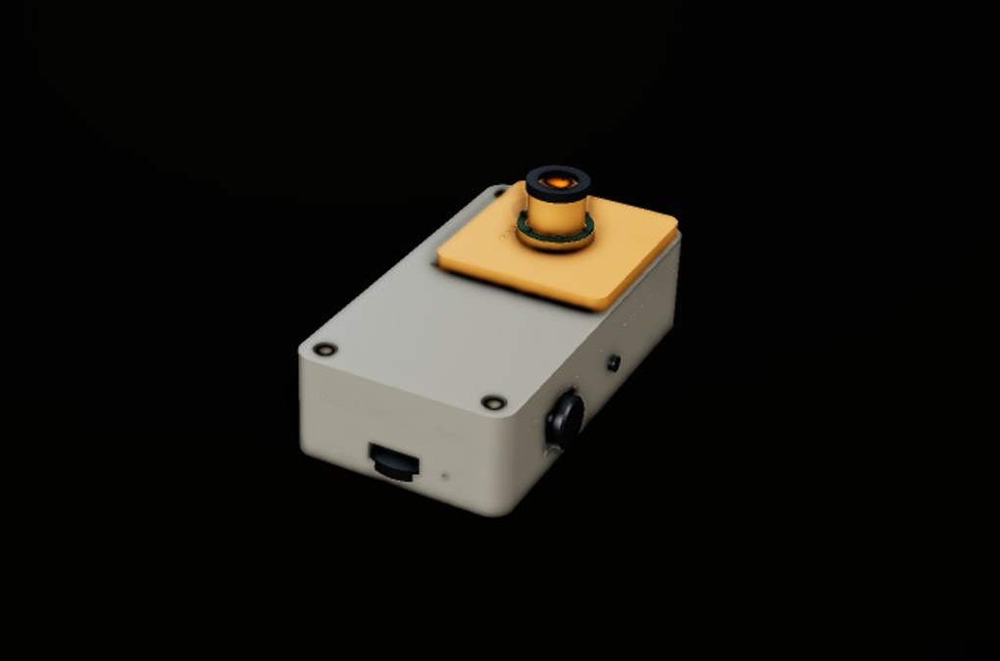

# VARA — a handheld perception instrument

> Point it at the world; slide on a cartridge, and it gains a new sense. The hero cartridge is
> a vision/macro lens — aim it at a plant, a part, a circuit, a label, and VARA identifies and
> explains it. The hero engineering component is the **dovetail rail connector** every cartridge
> shares, taken through a real, watchable optimization arc.



*Interactive showcase (explode the device, watch the connector evolve, see the point-and-identify
loop): run `web/` locally — see [Run the showcase](#run-the-showcase-locally). Pronounced
**VAH-rah**, from Sanskrit वर — "boon, the chosen thing."*

---

## Read this first — what VARA is, and isn't

VARA is **one complete, honest engineering pass** — hypothesis → printable enclosure + an
optimized connector → a representative integration → a working software prototype → an
interactive showcase → documentation — **not a manufactured product.**

- **No printer and no live hardware were in the loop.** Every fit, tolerance, force, and
  runtime here is **"validated-by-design," never "tested."** Where a number is analytical or an
  estimate, it says so.
- The **Raspberry Pi is the real brain**; the custom electronics are a **documented design**
  (schematic + netlist + BOM), **not a fabricated, routed, or electrically-verified board**.
- This honesty is the project's spine. For the robotics-lab role that seeded it, a credible
  end-to-end pass that's clear about its own boundaries is *more* useful than fake polish.

If you take one thing from this repo: **the record of decisions, dead ends, and tradeoffs is the
deliverable** — see [`BUILDLOG.md`](BUILDLOG.md).

---

## The story

**It starts with a capability probe, not a CAD model.** Before committing ambition, the tools
were tested ([`docs/tool-capabilities.md`](docs/tool-capabilities.md)): the FreeCAD MCP turned
out to be a dead stub, so all CAD runs on **build123d** (headless, parametric, diagnostics-first);
there's **no FEM available anywhere**, so stress is analytical and labelled as such; and **KiCad
was absent**, which set an honest ceiling for the electronics long before any schematic was drawn.

**The camera belongs in the core, not the cartridge.** A camera is a CSI-2 ribbon — far too fast
for a 6-pin pogo interface. Putting it in the core keeps the cartridge interface low-speed and
makes the hero cartridge *optics only*: a swappable macro lens over a fixed eye, like a microscope
objective. The payoff is a single constraint doing double duty — the cartridge lens must be
**coaxial** with the fixed camera, so the dovetail's **±0.28 mm** alignment budget governs the
*optical axis*, not just the electrical pads.

**The dovetail earned its place as the centerpiece** because its objectives genuinely fight:
locate precisely ↔ slide easily, lock firmly ↔ survive thousands of cycles, be stiff ↔ be
printable in PA12-CF. It was taken through **six problem-driven generations**
([`docs/dovetail-study.md`](docs/dovetail-study.md)), each fixing what the last exposed:

| Gen | What changed | Result |
|---:|---|---|
| **G1** | spec seed values | **catastrophic** — detent ε ≈ 13.5 %, ~1253 N to insert (it would shatter), alignment 0.40 mm |
| **G2** | a dedicated cantilever snap-finger | stress fixed in-plane, but fails the FDM interlayer case; alignment still off |
| **G3** | tighten clearance + declare a print-tolerance spec | alignment lands *exactly* on the 0.30 mm budget — kept as a marginal finding |
| **G4** | lower the detent depth | first **PASS** — but zero alignment margin |
| **G5** | thinner/longer finger, tighter fit | real margin — but the lock went soft (7.2 N) |
| **G6** | balance finger + detent + rail length | **resolved**: SF 5.1 / 2.56, **2.9 N** insert, **10.6 N** lock, **0.28 mm** alignment |

Beam theory understates the real stress at the finger root, so a **protected root fillet** carries
that load — and it's gated in code so a future refactor can't quietly shrink it. The marginal and
failing generations are kept, not hidden; they're how the part reasoned its way to a form.

**The electronics were designed honestly to a known ceiling.** `kicad-cli` validates and exports
but cannot place symbols, so the schematics were hand-authored as s-expressions and driven through
the CLI: openable `.kicad_sch`, an ERC-clean netlist (**0 unconnected pins**), and a BOM
([`docs/electronics.md`](docs/electronics.md)). The 6-pin contract — `V+ · GND · I²C SDA · I²C SCL
· CD# · INT` — maps exactly on both the core and the cartridge. **PCB routing was not pursued**
(the tool can't route); that limit is stated, not papered over.

**The prototype runs the real loop** ([`app/`](app/), [`docs/prototype.md`](docs/prototype.md)):
jog-press → camera capture → cloud vision identify → viewfinder + caption on the 1.69″ display →
speak. One detail is enforced *in code*: the shared V+ rail powers both the ID EEPROM and the LED
ring, and LED dimming PWMs that rail — so the firmware **must read the EEPROM ID before any PWM**.
`enable_power_pwm()` raises a `SequencingError` if it doesn't, and the demo proves the guard fires.
No Wi-Fi, no API key, or a timeout each produce a clean on-screen error — never a crash.

---

## Designed vs. representative — what I engineered, and what I selected

The line matters. **I engineered** the mechanical and interface design; I **selected** off-the-shelf
electronics and modelled them as dimensional stand-ins. This never rounds up to "designed the
electronics."

| **Designed by me** (geometry / interface / integration) | **Selected** (off-the-shelf, representative) |
|---|---|
| Dovetail connector — full optimization, male + female STLs | Raspberry Pi Zero 2 W (the compute / "brain") |
| Core enclosure (front housing + back cover), DfAM in PA12-CF | 1.69″ 240×280 ST7789 display module |
| Vision cartridge — lens barrel, LED-ring + EEPROM pockets, rails | Li-po cell, IP5306 PMIC, MAX98357A amp, USB-C |
| The 6-pin interface **contract** (pinout, EEPROM scheme, keep-outs) | Pi camera module + CSI ribbon |
| Fastener plan (M2.5 SHCS), heat-set bosses, print orientation | EC11 jog encoder, MEMS mic, speaker |
| The electronics **schematic / netlist / BOM** (a design) | — *(no routed PCB exists; not claimed)* |
| The Pi software pipeline + the read-before-PWM guard | — |

In the showcase teardown, every part carries a **DESIGNED** or **REPRESENTATIVE** badge for the
same reason.

---

## Repo map

```
vara/
  VARA_BUILD_PLAN.md   the master plan: scope, phases, honesty rules
  BUILDLOG.md          phase-by-phase decision record (read this for the process)
  docs/                architecture · connector-spec · dovetail-study · mechanical ·
                       electronics · prototype · tool-capabilities · future-cartridges
  cad/                 build123d sources + ST/STEP/glTF  (connector/ core/ cartridge/ showcase/)
  electronics/         hand-authored KiCad schematics, CLI-exported netlist/BOM/PDF, ERC
  app/                 the Pi prototype (capture → vision API → display + speak); see app/README.md
  web/                 the Three.js exploded showcase (static, no build)
```

## Run the showcase locally

It's static files, no build step — just serve the folder (ES modules need http, not `file://`):

```bash
cd web && python3 serve.py 8000      # no-cache static server → http://localhost:8000
# or any static server: python3 -m http.server 8000
```

Three scenes: **Explode** (drag the slider; tap a marker for what each part does *and why*),
**Connector** (step/play the six generations with the real numbers), **Identify** (the
point-and-identify story with the real prototype frames). Drag to orbit; use the **view** presets.
Needs internet (three.js loads from the jsdelivr CDN).

## Run the Pi app

See [`app/README.md`](app/README.md) for flashing a Zero 2 W and wiring. Off-device, the logic
path runs with stubs:

```bash
pip install pillow anthropic
python3 -m app.demo        # exercises init + a scan + every failure mode
```

**What's stubbed off-device:** camera, display, audio, encoder, cartridge I²C, and the vision API
are swappable stubs (each logs "STUB" at startup); the rendered display frames are real. On a Pi
with the libs + an `ANTHROPIC_API_KEY` in a gitignored `.env`, the real drivers take over. The app
is **logic-validated, not hardware-tested**.

---

## License

Mixed software + hardware, so the recommendation is a **dual license** — see [`LICENSE`](LICENSE):
**MIT** for the software (`app/`, `web/`, build scripts) and **CERN-OHL-S v2** (strongly
reciprocal) for the hardware (`cad/`, `electronics/`). MIT keeps the software trivially reusable;
CERN-OHL-S keeps hardware derivatives open. (A single permissive license is the alternative if
simplicity matters more — the tradeoff is laid out in `LICENSE`.)

## Built with

- **[build123d](https://github.com/gumyr/build123d)** 0.10 via the **forge-cad** pipeline — all parametric CAD, diagnostics, and glTF export.
- **[three.js](https://threejs.org/)** r160 (CDN-pinned) — the interactive showcase.
- **[KiCad](https://www.kicad.org/)** 10.0.3 (`kicad-cli`) — schematic validation + netlist/BOM/PDF export.
- **Raspberry Pi Zero 2 W** + the **Anthropic** vision API — the prototype brain and perception.

*A complete engineering pass, documented as an engineer would — decisions, tradeoffs, and dead ends.*
