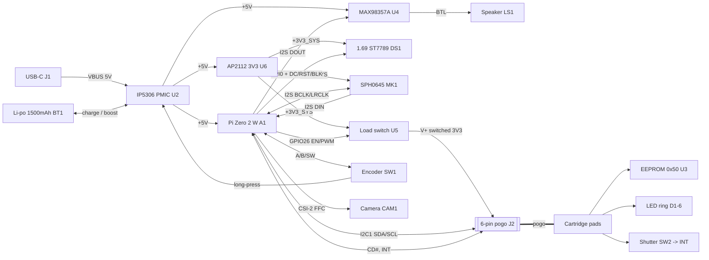

# VARA — Electronics Design (Phase 4)

**Date:** 2026-06-03 · Artifacts: `electronics/netlist.csv`, `electronics/bom.csv`,
(stretch) `electronics/vara.kicad_*`. Tied to `connector-spec.md` **v0.2** (6-pin pogo).

> ## ⚠️ Honesty banner — read first
> **This is a DESIGN — schematic + footprints + BOM — NOT a DRC-clean, manufactured, or
> electrically-verified board.** No SPICE, no signal-integrity, no power-rail validation, no
> hardware. **No fake netlists:** every net in `netlist.csv` traces either to the frozen
> connector contract (the 6 pogo pins) or to a named component pin from `bom.csv`. Pin
> numbers for the Pi header are the physical 40-pin positions; verify against the chosen
> module before fab. Treat all of this as "validated-by-design," never tested.

---

## 1. Tooling ceiling (Phase 0 discipline, re-probed for Phase 4)
See the **Phase 4 addendum in `tool-capabilities.md`** for the empirical re-probe. Summary:
KiCad **10.0.3** installed (cask fetch + manual app extraction — full cask needs sudo);
`kicad-cli` **validates/exports but cannot place symbols**, so schematics are hand-authored
as `.kicad_sch` then driven through the CLI.

**Both floor and stretch are delivered:**
- **Floor:** `electronics/netlist.csv`, `electronics/bom.csv`, block diagram (§2), contract
  mapping (§3).
- **Stretch (verified working):** openable, ERC-checked `vara_core.kicad_sch` +
  `vara_cartridge.kicad_sch` (generated by `gen_kicad_sch.py`), with CLI-exported
  **netlist** (`*.net`), **BOM** (`*.bom.csv`), and **PDF** (`*.pdf`).
  - **Connectivity proven by the exported netlist:** core = **29 nets, 0 unconnected pins**;
    cartridge = **6 nets, 0 unconnected pins**. The 6 contract nets map exactly (§3).
  - **ERC:** no electrical errors; only cosmetic warnings remain — `lib_symbol_issues` /
    `footprint_link_issues` (the custom symbol lib and footprints aren't registered in a
    project library table; symbols are embedded so the files open, footprints are referenced
    by name for the BOM). No dangling labels, no unconnected pins.
- **PCB layout NOT pursued:** `kicad-cli pcb` cannot place/route; per the brief, routing is
  optional dessert. We stop at schematic + netlist + BOM + PDF depth.

---

## 2. System block diagram

---

## 3. The cartridge interface — netlist tied EXACTLY to `connector-spec.md` v0.2
The contract is 6 pins. Every one maps to a real net on both sides:

| Pin | Contract net | CORE side (net / node) | CARTRIDGE side (net / node) |
|----:|---|---|---|
| 1 | **V+ (3V3 switched)** | `V+_SW` ← U5.VOUT (load switch, ≤150 mA, EN=GPIO26) | `CV+` → U3.VCC + LED-ring anodes |
| 2 | **GND** | `GND` (J2.2) | `CGND` → U3.GND/A0/A1/A2/WP, LED return, SW2 |
| 3 | **I²C SDA** | `I2C_SDA` ← GPIO2, pull-up R1 4.7k→3V3 | `CSDA` → U3.SDA |
| 4 | **I²C SCL** | `I2C_SCL` ← GPIO3, pull-up R2 4.7k→3V3 | `CSCL` → U3.SCL |
| 5 | **CD# (detect)** | `CART_CD` ← GPIO23, pull-up R3 10k→3V3 | `CCD` = **hard-tied to GND** (presence) |
| 6 | **INT** | `CART_INT` ← GPIO12, pull-up R4 10k→3V3 | `CINT` ← SW2 shutter (to GND when pressed) |

**Mate/power sequence (firmware, per connector-spec §4.2):** CD# falls (seated) → Pi enables
`CART_VEN` (V+ load switch on) → settle → read EEPROM @0x50 → configure pipeline → arm INT.

---

## 4. Subsystem notes & deliberate design decisions
- **Power chain:** IP5306 does charge + 5 V boost + power-path + button + fuel gauge in one
  chip (board-area win). Pi runs from +5 V and uses its own internal regulators. A separate
  **AP2112 3V3 LDO (U6)** derives `+3V3_SYS` for peripherals **and** the switched cartridge
  rail — deliberately **not** tapping the Pi's weak 3V3 header pin, which couldn't source the
  cartridge's ≤150 mA.
- **Switched cartridge rail (U5):** a current-limited load switch gates V+ so (a) a fault on a
  cartridge can't brown out the core, and (b) V+ is off until the core has identified the
  cartridge. `R5` 100k holds it off at boot.
- **LED-ring dimming without a 7th pin:** there is no dedicated PWM line in the 6-pin
  contract, so the **core PWMs the V+ load switch (GPIO26)** to dim the ring. The EEPROM is
  read **once at insertion while V+ is steady**, *before* any PWM — so power-cycling the rail
  for dimming doesn't disturb ID. Documented tradeoff, not a hidden hack.
- **Audio:** I²S mic (SPH0645) and amp (MAX98357A) share BCLK/LRCLK; mic on PCM_DIN, amp on
  PCM_DOUT — standard full-duplex I²S.
- **Camera:** Pi camera connects by the **CSI-2 FFC ribbon to the Pi's camera port (J3),
  NOT through the pogo pins** — CSI is far too high-bandwidth for the 6-pin low-speed contract
  (this is *why* the camera lives in the core; see architecture.md §2).
- **Single control:** the EC11 encoder's A/B/SW go to the Pi for UI.

## 5. Known integration risks (named, per honesty rules)
1. **Shared button (`ENC_SW` = `PWR_KEY`):** the encoder push drives both a Pi GPIO (UI) and
   the IP5306 KEY (power). IP5306's long-press/double-click power behaviour can collide with
   UI gestures. **Mitigation option** if it proves annoying: a separate dedicated power
   tactile on KEY, freeing the encoder for UI only. Flagged for bench resolution.
2. **Pi header pin numbers** are the physical positions for a standard 40-pin Zero 2 W; the
   chosen GPIO↔function map (SPI0, I²C1, I²S, the GPIO assignments) must be confirmed against
   the device-tree overlay before fab.
3. **Current budget:** the ≤150 mA cartridge rail assumes a modest LED ring (6× ~20 mA with
   R6 limiting). A brighter ring needs a rethink of U5 / rail sizing.
4. **No power-integrity / EMC / thermal analysis** has been done.

## 6. What is explicitly NOT claimed
No DRC pass, no routed-and-poured copper claimed as verified, no impedance control, no
manufactured board, no electrical bring-up. The deliverable is a **coherent, contract-tied
design** an engineer could take to layout — and the stretch artifacts (if the probe allows)
are an **openable KiCad project**, still a design, not a verified board.

## 7. Outputs
**Floor:**
- `electronics/netlist.csv` — every net, every node, tied to the connector contract or a BOM pin.
- `electronics/bom.csv` — full BOM with part numbers, packages + subsystems.

**Stretch (openable KiCad project + CLI exports):**
- `electronics/vara_core.kicad_sch`, `electronics/vara_cartridge.kicad_sch` — hand-authored,
  ERC-clean (cosmetic warnings only). Open in KiCad 10.
- `electronics/gen_kicad_sch.py` — the generator (single source: components + per-pin nets).
- `electronics/vara_core.net`, `vara_cartridge.net` — CLI-exported netlists (connectivity proof).
- `electronics/vara_core.bom.csv`, `vara_cartridge.bom.csv` — CLI-exported BOMs.
- `electronics/vara_core.pdf`, `vara_cartridge.pdf` — rendered schematics.
- `electronics/*.erc.rpt` — ERC reports. `electronics/*.kicad_pro` — project files.

> Reproduce: `python3 electronics/gen_kicad_sch.py` then
> `kicad-cli sch {erc,export netlist,export bom,export pdf} electronics/vara_core.kicad_sch`.
